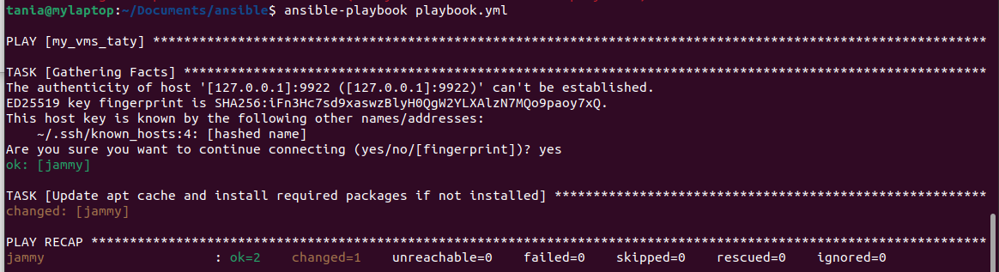

# Напишите playbook для установки на устройство следующих пакетов:

## cmatrix,
cowsay,
sl.
Устройство нужно включить в группу со своей фамилией в качестве названия. Например:

[Ivanov]
192.168.1.2 …
 

Условия реализации
В качестве ответа предоставьте:

- [x] файлы конфигурации [ansible.cfg](./ansible.cfg), [hosts](./hosts);
- [x] файл [playbook](./playbook.yml);
- [x] скриншот вывода результатов работы PLAY.

Все результаты необходимо загрузить на свой GitHub и прикрепить ссылку на репозиторий в качестве ответа.

 
